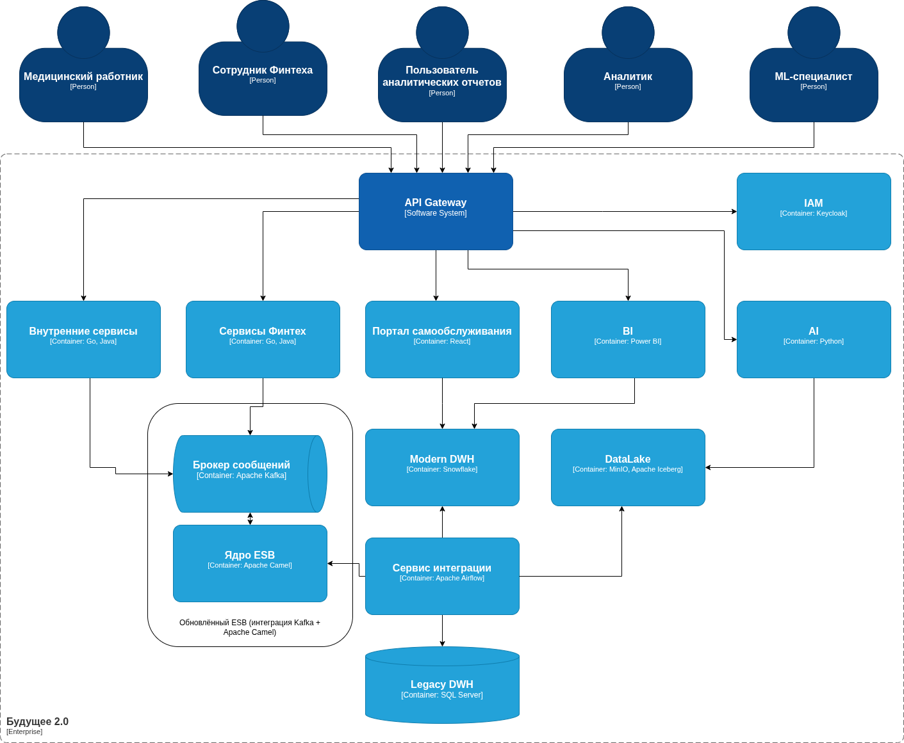

## 1. Диаграмма контейнеров
 
 
### 2. Ключевые проблемные зоны  

| №   | Область                                | Основные проблемы и их последствия                                                                                             |
| --- | -------------------------------------- | ------------------------------------------------------------------------------------------------------------------------------ |
| 1   | Монолитная DWH на базе SQL Server 2008 | - Низкая масштабируемость, длительное выполнение отчётов   - Сложность модификации бизнес-логики из-за высокой связанности |
| 2   | Клиентские приложения на Power Builder | - Устаревший интерфейс, высокая стоимость поддержки, отсутствие мобильности   - Замедляет миграцию в облако                |
| 3   | Интеграционная шина на Apache Camel    | - Сложности с отслеживанием данных   - Ограниченная поддержка новых источников (банки, фармацевтика)                       |
| 4   | Объединение доменов (медицина, финтех) | - Высокая связность: изменения в DWH могут нарушить отчёты во всех направлениях бизнеса                                        |
| 5   | Отсутствие каталога метаданных         | - Пользователи не ориентируются в данных — частые запросы к разработчикам                                                      |
| 6   | Контроль доступа и безопасность        | - Совместное хранение медицинских и финансовых данных — риски утечки   - Недостаточная детализация прав доступа            |

### 3. Расстановка приоритетов по методу MoSCoW  

| Категория  | Планируемые изменения                                                                                                                                                                                |
| ---------- |------------------------------------------------------------------------------------------------------------------------------------------------------------------------------------------------------|
| **Must**   | - Миграция DWH в облачную MPP-платформу Snowflake для масштабируемости  - Внедрение Data Catalog и системы управления доступом IAM  - Унификация ELT-процессов Apache Airflow для всех доменов |
| **Should** | - Интеграция Apache Camel с Kafka для улучшения трассировки и скорости обработки данных. Это также позволит значительно повысить отказоустойчивость системы.                                         |
| **Could**  | - Разработка нового веб-интерфейса для клиник React с интеграцией в портал  - Внедрение data-mesh для изоляции бизнес-доменов                                                                     |
| **Won’t**  | - Полная одномоментная миграция, слишком высокие риски и длительные сроки                                                                                                                            |
