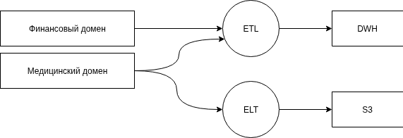

## Описание доменов  

| Область данных    | Содержание                                                                                                |
| ----------------- | --------------------------------------------------------------------------------------------------------- |
| Медицинский домен | Информация о пациентах, медицинские записи и истории болезней, включая результаты обследований и анализов |
| Финансовый домен  | Финансовые операции, платежные документы, кредитная история                                               |
## Data Flow Diagram

## Ключевые преимущества  

- **Независимость команд** — каждая команда управляет доступом и обработкой своих данных  
- **Простое администрирование** — отсутствие единого централизованного контроля  
- **Изолированная архитектура** — сбои в одном домене не влияют на работу всей системы  
